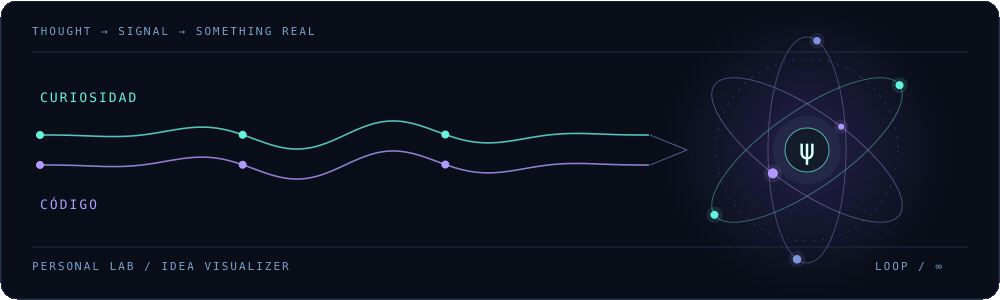

<div align="center">


**Software developer · Explorador de computación cuántica · Constructor de ideas**

[El humano](#01--el-humano) &nbsp; / &nbsp; [El arsenal](#02--el-arsenal) &nbsp; / &nbsp; [Los experimentos](#03--los-experimentos) &nbsp; / &nbsp; [Fuera del editor](#04--fuera-del-editor)

[](https://www.linkedin.com/in/juan-jose-lopez-lopez-73214b279) &nbsp; [](https://github.com/JuanJoseLL?tab=repositories)

<sub>Entre lo que ya funciona y lo que todavía parece imposible.</sub>

</div>

## 01 / El humano

Soy **Juan José**. Me gusta entender cómo funcionan las cosas, construir software que resuelva problemas reales y explorar qué viene después. Del backend a la interfaz, del código a la infraestructura.

La **computación cuántica** despierta mi curiosidad. La **inteligencia artificial**, los **sistemas distribuidos** y las buenas preguntas me mantienen construyendo.

```text
juan@lab:~$ cat mindset.txt

  construir   →  hacer que una idea funcione en el mundo real
  entender    →  ir más allá del «porque así se hace»
  simplificar →  el mejor código no necesita presumir
  compartir   →  las buenas ideas crecen en compañía
```

<div align="center">
  
  <br />
  <sub>FIG. 01 &nbsp; — &nbsp; De una pregunta a algo que funciona.</sub>
</div>

## 02 / El arsenal

Las herramientas cambian. La curiosidad se queda.

<picture>
  <source media="(max-width: 640px)" srcset="./assets/stack-mobile.svg" />
  
</picture>

<details>
<summary><strong>Ver el inventario en modo texto</strong></summary>

| Capa | Herramientas |
| :--- | :--- |
| Lenguajes | Java · Python · TypeScript · Go |
| Interfaces | React · Next.js · Vue · Tailwind CSS |
| Backend | Spring Boot · FastAPI · Django · NestJS |
| Datos | PostgreSQL · MongoDB · Redis · Oracle |
| Cloud e infraestructura | AWS · Azure · Docker · Terraform |
| Automatización | GitHub Actions · Jenkins · Ansible |

</details>

## 03 / Los experimentos

Ideas que salieron del editor y se convirtieron en repositorios.

| Experimento | Qué hay dentro |
| :--- | :--- |
| [**01 — Stock Recommender ↗**](https://github.com/JuanJoseLL/stock-recommender) | Análisis de acciones, recomendaciones y una aplicación de extremo a extremo. **Go · Vue · AWS · Terraform** |
| [**02 — Agentic RAG ↗**](https://github.com/JuanJoseLL/agentic-rag-langGraph) | Un laboratorio de recuperación de información y agentes. **Python · LangGraph** |
| [**03 — API Gateway ↗**](https://github.com/JuanJoseLL/api-gateway) | Una pieza de mi exploración de arquitecturas de microservicios. **Java** |
| [**04 — Multi-database App ↗**](https://github.com/JuanJoseLL/sid-project) | PostgreSQL, MongoDB y Redis conviviendo en una aplicación. **TypeScript** |

<div align="center">

[**Ver el resto del laboratorio →**](https://github.com/JuanJoseLL?tab=repositories)

</div>

## 04 / Fuera del editor

También me gustan las historias que dejan algo dando vueltas en la cabeza.


| Arrival | Creed | Avatar |
| :--- | :--- | :--- |
| Cambiar la perspectiva puede cambiarlo todo. | Avanzar también es volver a intentarlo. | Imaginar mundos es el primer paso para construirlos. |

<br />

<details>
<summary><strong>⟨ ψ ⟩ &nbsp; Hay dos estados posibles. Haz clic para colapsar la función de onda.</strong></summary>

<br />

```text
                    ┌────────────────────────────┐
                    │                            │
                    │   IDEA  ────────►  CÓDIGO  │
                    │     ▲                │     │
                    │     └── APRENDER ◄───┘     │
                    │                            │
                    │   No era magia.            │
                    │   Era curiosidad + café.   │
                    │                            │
                    └────────────────────────────┘
```

</details>

<br />

<div align="center">


<sub>Hecho con código, curiosidad y unas cuantas partículas fuera de lugar.</sub>

</div>
