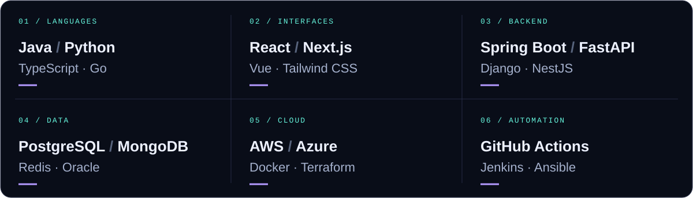

<div align="center">



<br />

<a href="https://www.linkedin.com/in/juan-jose-lopez-lopez-73214b279"></a>&nbsp;&nbsp;<a href="https://github.com/JuanJoseLL?tab=repositories"></a>

<sub>[01 · El humano](#01--el-humano) &nbsp;/&nbsp; [02 · El detector](#02--el-detector) &nbsp;/&nbsp; [03 · El arsenal](#03--el-arsenal) &nbsp;/&nbsp; [04 · Los experimentos](#04--los-experimentos) &nbsp;/&nbsp; [05 · Fuera del editor](#05--fuera-del-editor)</sub>

</div>

<br />

## 01 / El humano

Soy **Juan José**, software developer. Me gusta entender cómo funcionan las cosas por dentro y construir software que resuelva problemas reales: del backend a la interfaz, del código a la infraestructura.

La **computación cuántica** despierta mi curiosidad. La **inteligencia artificial**, los **sistemas distribuidos** y las buenas preguntas me mantienen construyendo.

```text
juan@lab:~$ cat mindset.txt

  construir   →  hacer que una idea funcione en el mundo real
  entender    →  ir más allá del «porque así se hace»
  simplificar →  el mejor código no necesita presumir
  compartir   →  las buenas ideas crecen en compañía
  acelerar    →  velocidad, soy veloz ⚡
```

## 02 / El detector

Esto no es una captura: es una medición. Cada noche una GitHub Action consulta mi actividad y vuelve a dibujar este detector. Cada torre del anillo es un día del último año; los días más intensos disparan trazas desde el vértice.



## 03 / El arsenal

Las herramientas cambian. La curiosidad se queda.

<picture>
  <source media="(max-width: 640px)" srcset="./assets/stack-mobile.svg" />
  
</picture>

<details>
<summary><strong>Ver el inventario en modo texto</strong></summary>

| Grupo | Elementos |
| :--- | :--- |
| G1 · Lenguajes | Java · Python · TypeScript · Go |
| G2 · Interfaces | React · Next.js · Vue · Tailwind CSS |
| G3 · Backend | Spring Boot · FastAPI · Django · NestJS |
| G4 · Datos | PostgreSQL · MongoDB · Redis · Oracle |
| G5 · Cloud | AWS · Azure · Docker · Terraform |
| G6 · DevOps e IA | GitHub Actions · Jenkins · Ansible · LangGraph |

</details>

## 04 / Los experimentos

Ideas que salieron del editor y se convirtieron en repositorios. Cada tarjeta lleva a su código.

<p align="center">
  <a href="https://github.com/JuanJoseLL/stock-recommender"></a>
  <a href="https://github.com/JuanJoseLL/agentic-rag-langGraph"></a>
</p>
<p align="center">
  <a href="https://github.com/JuanJoseLL/api-gateway"></a>
  <a href="https://github.com/JuanJoseLL/sid-project"></a>
</p>

<div align="center">

[**Ver el resto del laboratorio →**](https://github.com/JuanJoseLL?tab=repositories)

</div>

## 05 / Fuera del editor

También me gustan las historias que dejan algo dando vueltas en la cabeza.



<br />

<details>
<summary><strong>⟨ψ⟩ &nbsp; Hay dos estados posibles. Haz clic para colapsar la función de onda.</strong></summary>

<br />



</details>

<br />

<div align="center">



<sub>Cada imagen de este perfil está dibujada con código en <a href="./scripts"><code>scripts/</code></a>: tipografía convertida en vectores, partículas y un detector que se recalibra solo cada día.</sub>

</div>
